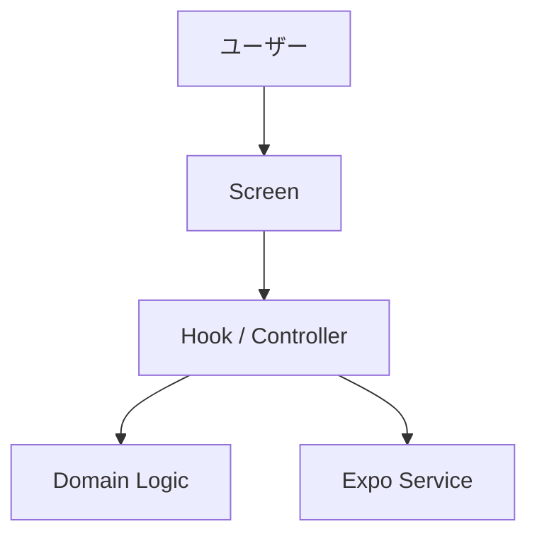
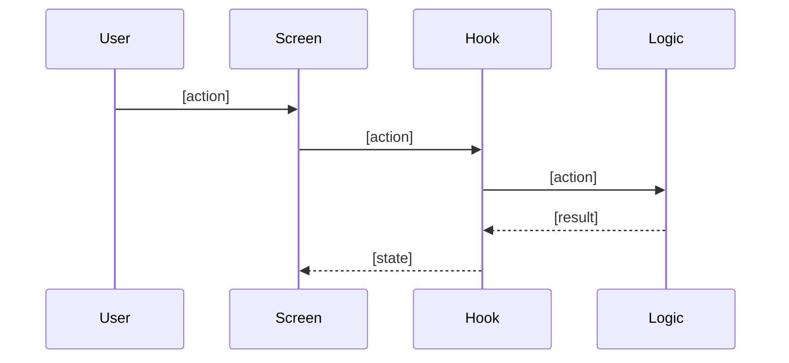
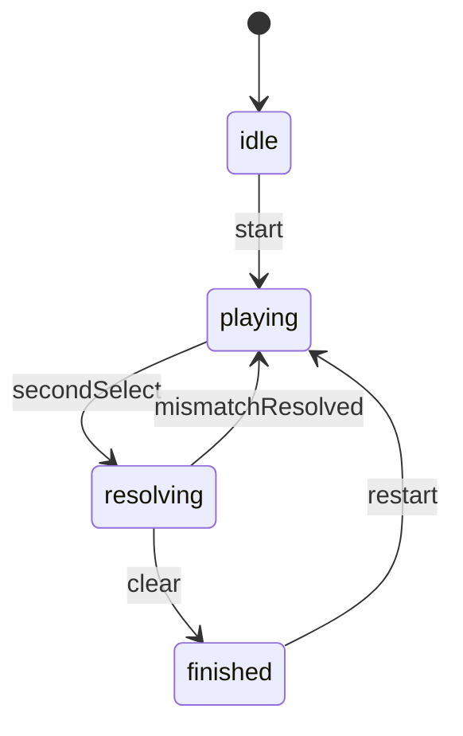

# 機能設計書 (Functional Design Document)

## 対象範囲

- 本書が扱う MVP 範囲:
- 対象外:
- 将来拡張:

## システム構成図



## 技術スタック

| 分類 | 技術 | 選定理由 |
|------|------|----------|
| 言語 | JavaScript (ES2022) | [理由] |
| フレームワーク | React Native + Expo | [理由] |
| unit test | Vitest | [理由] |
| component test | `@testing-library/react-native` | [理由] |

## データモデル定義

### エンティティ: [EntityName]

```javascript
/**
 * @typedef {Object} [EntityName]
 * @property {string} id
 * @property {[type]} [field1]
 * @property {[type]} [field2]
 */
```

**制約**:
- [制約1]
- [制約2]

### エンティティ: [StateName]

```javascript
/**
 * @typedef {'idle' | 'loading' | 'ready' | 'finished'} [StatusName]
 */

/**
 * @typedef {Object} [StateName]
 * @property {[EntityName][]} items
 * @property {[StatusName]} status
 * @property {string[]} selectedIds
 */
```

**制約**:
- [制約1]
- [制約2]

## コンポーネント設計

### [ScreenName]

**責務**:
- [責務1]
- [責務2]

**インターフェース**:
```javascript
/**
 * @typedef {Object} [ScreenName]Props
 * @property {() => void} [action]
 */
```

**依存関係**:
- [依存1]
- [依存2]

### [HookName]

**責務**:
- [責務1]
- [責務2]

**インターフェース**:
```javascript
/**
 * @typedef {Object} [HookName]Result
 * @property {[StateName]} state
 * @property {() => void} start
 * @property {(id: string) => void} select
 */
```

**依存関係**:
- [依存1]
- [依存2]

### [ServiceName]

**責務**:
- [責務1]
- [責務2]

**インターフェース**:
```javascript
/**
 * @typedef {Object} [ServiceName]
 * @property {(kind: string) => Promise<void>} run
 */
```

## ユースケース

### [ユースケース名]



**フロー説明**:
1. [ステップ1]
2. [ステップ2]
3. [ステップ3]

## 状態遷移



**入力制御**:
- [無効入力条件]
- [入力ロック条件]

## エラーハンドリング

| 種別 | 条件 | UI / 処理 |
|------|------|-----------|
| [種別1] | [条件] | [対応] |
| [種別2] | [条件] | [対応] |

## テスト戦略

### unit test
- [対象1]
- [対象2]

### component test
- [対象1]
- [対象2]

### 起動確認

```bash
npm run lint
npm test
npx expo start
```

## パフォーマンス / UX

- [考慮1]
- [考慮2]
