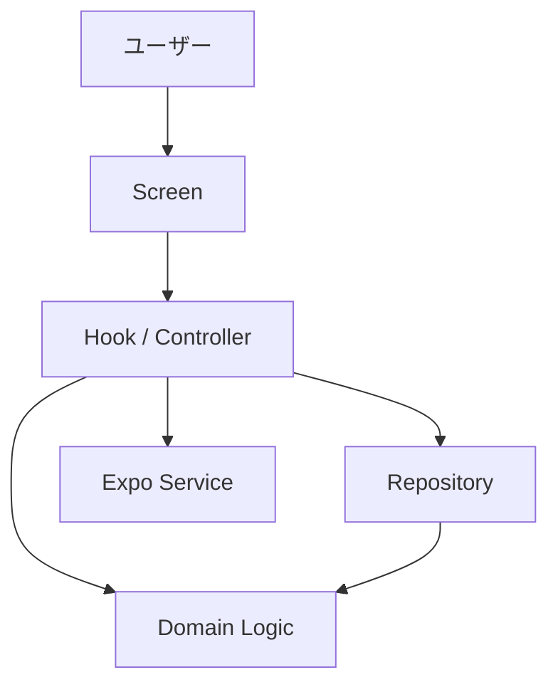
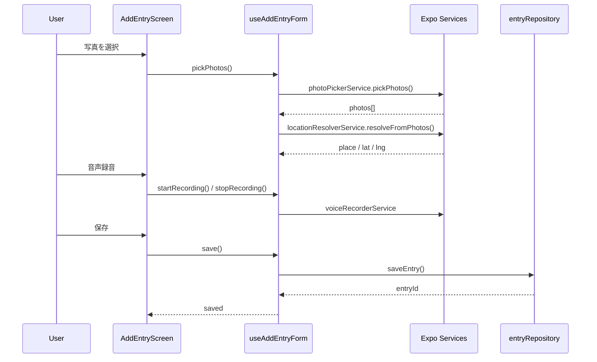
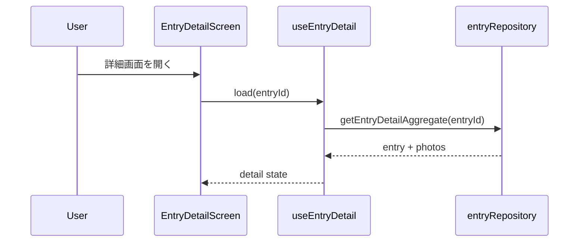
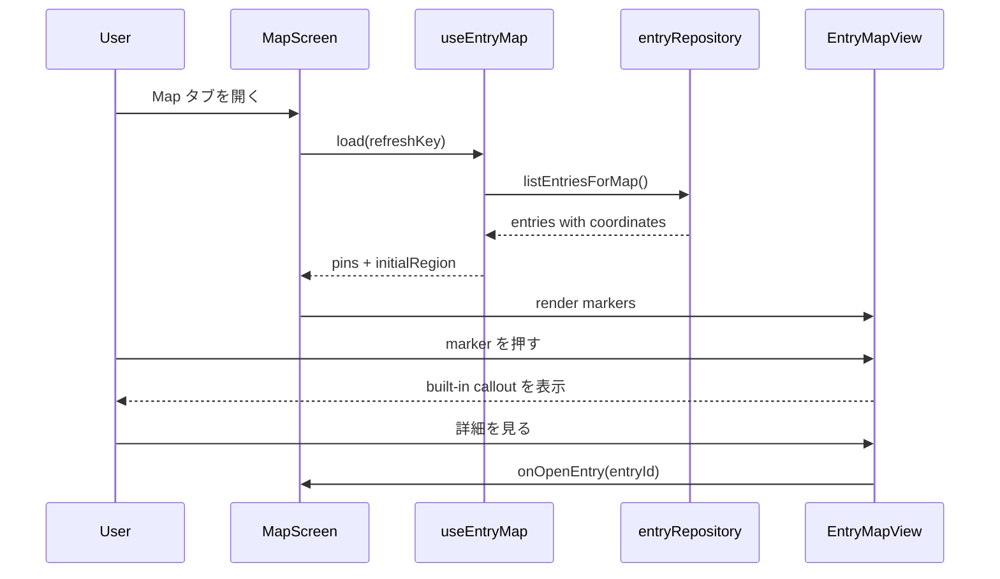
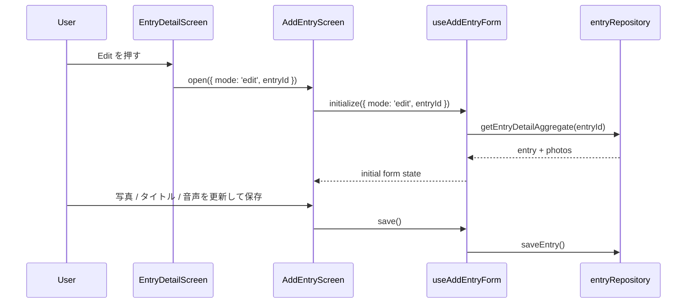
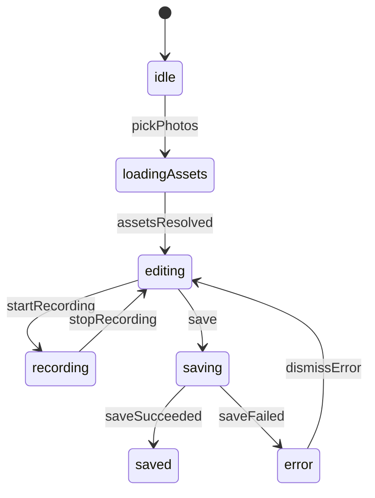

# 機能設計書 (Functional Design Document)

## 対象範囲

- 本書が扱う MVP 範囲:
  - 複数写真 + 単一音声メモによるイベント作成
  - イベント一覧タイムライン
  - 地図表示
  - イベント詳細表示と再編集
  - SQLite とローカルファイルを用いたオフライン永続化
- 対象外:
  - Mac mini とのバックアップ同期
  - 家族共有
  - AI 日記生成、AI イベント検出
- 将来拡張:
  - `syncQueue` の実装
  - 背景同期
  - 自動アルバム生成

## システム構成図



## 技術スタック

| 分類 | 技術 | 選定理由 |
|------|------|----------|
| 言語 | JavaScript (ES2022) | TypeScript を導入せず、Expo managed workflow の初期構成と整合させる |
| フレームワーク | React Native + Expo | モバイル UI と端末機能を一貫して扱える |
| ナビゲーション | React Navigation | タブ + スタック遷移を組み合わせやすい |
| 地図 | `react-native-maps` | MapScreen 上でイベントピンを表示するため |
| 画像取得 | `expo-image-picker` | カメラ / フォトライブラリからの写真選択を扱うため |
| カメラ | `expo-camera` | 将来のアプリ内撮影導線に備えるため |
| 位置情報 | `expo-location` | EXIF がない場合の端末位置取得に使うため |
| 音声 | `expo-av` | 音声録音と再生を統一的に扱うため |
| ローカル DB | `expo-sqlite` | Entry と Photo のメタデータをオフラインで保持するため |
| unit test | Jest + jest-expo | Expo SDK 54 と React Native コンポーネントを同じ実行基盤で検証しやすいため |
| component test | `@testing-library/react-native` | 主要画面フローを UI 観点で検証するため |

## データモデル定義

### エンティティ: Entry

```javascript
/**
 * @typedef {'localOnly' | 'pendingSync' | 'synced' | 'syncFailed'} EntrySyncStatus
 */
/**
 * @typedef {Object} Entry
 * @property {string} id
 * @property {string} title
 * @property {string} eventDate
 * @property {string} createdAt
 * @property {string} updatedAt
 * @property {number | null} lat
 * @property {number | null} lng
 * @property {string | null} placeName
 * @property {string | null} voicePath
 * @property {string | null} coverPhotoUri
 * @property {number} photoCount
 * @property {EntrySyncStatus} syncStatus
 */
```

**制約**:
- `title` は `placeName + date` を基本とし、位置名がない場合は日付のみで生成する
- `coverPhotoUri` はイベント内の先頭写真 URI と一致させる
- MVP では `syncStatus` の初期値を `localOnly` とする

### エンティティ: EntryDetailAggregate

```javascript
/**
 * @typedef {Object} EntryDetailAggregate
 * @property {Entry} entry
 * @property {PhotoAsset[]} photos
 */
```

**制約**:
- `EntryDetailAggregate` は詳細閲覧画面と編集モード初期化で使う集約データとする
- `entry` は一覧表示でも使う `Entry` を保持し、詳細専用の写真配列は `photos` に分離する

### エンティティ: PhotoAsset

```javascript
/**
 * @typedef {Object} PhotoAsset
 * @property {string} id
 * @property {string} entryId
 * @property {string} localUri
 * @property {string | null} originalFilename
 * @property {number | null} width
 * @property {number | null} height
 * @property {number | null} lat
 * @property {number | null} lng
 * @property {string | null} takenAt
 * @property {number} sortOrder
 */
```

**制約**:
- `localUri` は Camera Roll または Image Picker が返す参照を保持し、アプリ内へ複製しない
- `sortOrder` は選択順を保持し、0 番目の写真をカバー画像として扱う

### エンティティ: AddEntryFormState

```javascript
/**
 * @typedef {'idle' | 'loadingAssets' | 'editing' | 'recording' | 'saving' | 'saved' | 'error'} AddEntryStatus
 */
/**
 * @typedef {Object} AddEntryFormState
 * @property {PhotoAsset[]} photos
 * @property {string | null} draftVoicePath
 * @property {number | null} lat
 * @property {number | null} lng
 * @property {string | null} placeName
 * @property {string} title
 * @property {AddEntryStatus} status
 * @property {boolean} canSave
 * @property {string | null} errorMessage
 */
```

**制約**:
- `photos.length >= 1` のときのみ `canSave` を `true` にできる
- `recording` 中は保存と再録音以外の入力をロックする

### エンティティ: EntryTimelineState

```javascript
/**
 * @typedef {'idle' | 'loading' | 'ready' | 'error'} LoadStatus
 */
/**
 * @typedef {Object} EntryTimelineState
 * @property {Entry[]} items
 * @property {LoadStatus} status
 * @property {string | null} errorMessage
 */
```

**制約**:
- 一覧は `eventDate DESC, createdAt DESC` で並べる
- `error` 状態でも最後に読み込めたイベントがあれば表示を継続する

## コンポーネント設計

### EntryListScreen

**責務**:
- イベントタイムラインの表示
- 新規作成導線と詳細画面遷移の提供

**インターフェース**:
```javascript
/**
 * @typedef {Object} EntryListScreenProps
 * @property {() => void} onCreateEntry
 * @property {(entryId: string) => void} onOpenEntry
 */
```

**依存関係**:
- `useEntryTimeline`
- `EntryTimelineList`

### MapScreen

**責務**:
- 地図上のイベントピン表示
- built-in callout によるピンプレビューと詳細遷移
- 空状態 / エラー状態 / 再読込状態の表示
- タブ復帰時の再読込結果を反映する

**インターフェース**:
```javascript
/**
 * @typedef {Object} MapScreenProps
 * @property {(entryId: string) => void} onOpenEntry
 * @property {number} refreshKey
 */
```

**依存関係**:
- `useEntryMap`
- `EntryMapView`

### AddEntryScreen

**責務**:
- 新規イベント作成
- 既存イベント編集
- 写真一覧、音声録音、位置解決、保存のフォーム表示
- 編集モード初期化時の既存値表示
- タイトル入力欄を上部に配置し、キーボード表示時も編集状態を見失いにくくする

**インターフェース**:
```javascript
/**
 * @typedef {Object} AddEntryScreenCreateParams
 * @property {'create'} mode
 */
/**
 * @typedef {Object} AddEntryScreenEditParams
 * @property {'edit'} mode
 * @property {string} entryId
 */
/**
 * @typedef {Object} AddEntryScreenProps
 * @property {AddEntryScreenCreateParams | AddEntryScreenEditParams} routeParams
 * @property {() => void} onSaved
 * @property {() => void} onCancel
 */
```

**依存関係**:
- `useAddEntryForm`
- `PhotoStrip`
- `VoiceRecorderPanel`

### EntryDetailScreen

**責務**:
- 保存済みイベントの閲覧
- 写真、音声、位置、日付、タイトルの表示
- `Edit` から編集モードへ遷移する導線の提供
- 写真はプレビュー、音声は再生コントロールとして表示し、 raw path は UI に露出しない

**インターフェース**:
```javascript
/**
 * @typedef {Object} EntryDetailScreenProps
 * @property {string} entryId
 * @property {(entryId: string) => void} onEditEntry
 */
```

**依存関係**:
- `useEntryDetail`
- `PhotoCarousel`
- `VoicePlayer`

### useEntryTimeline

**責務**:
- 一覧データ読み込み
- pull to refresh や再読込の制御

**インターフェース**:
```javascript
/**
 * @typedef {Object} UseEntryTimelineResult
 * @property {EntryTimelineState} state
 * @property {() => Promise<void>} refresh
 */
```

**依存関係**:
- `entryRepository`
- `groupEntriesByDate`

### useAddEntryForm

**責務**:
- AddEntry の create / edit 両モードの状態遷移を一元管理する
- 位置解決、音声録音、保存処理を調停する

**インターフェース**:
```javascript
/**
 * @typedef {Object} UseAddEntryFormCreateInput
 * @property {'create'} mode
 */
/**
 * @typedef {Object} UseAddEntryFormEditInput
 * @property {'edit'} mode
 * @property {string} entryId
 */
/**
 * @typedef {Object} UseAddEntryFormResult
 * @property {AddEntryFormState} state
 * @property {() => Promise<void>} pickPhotos
 * @property {() => Promise<void>} startRecording
 * @property {() => Promise<void>} stopRecording
 * @property {() => Promise<void>} save
 * @property {(title: string) => void} updateTitle
 */
```

**依存関係**:
- `photoPickerService`
- `voiceRecorderService`
- `locationResolverService`
- `entryRepository`
- `createEntryTitle`

### useEntryMap

**責務**:
- 地図用ピンデータの読み込みと生成
- 初期表示範囲の計算
- 選択中ピンの管理
- タブ復帰時や明示再読込時の再フェッチ

**インターフェース**:
```javascript
/**
 * @typedef {Object} EntryMapSummary
 * @property {string} id
 * @property {string} title
 * @property {string} eventDate
 * @property {string | null} placeName
 * @property {string | null} coverPhotoUri
 * @property {number} lat
 * @property {number} lng
 */
/**
 * @typedef {Object} EntryMapPin
 * @property {string} id
 * @property {string} title
 * @property {string} eventDate
 * @property {string | null} placeName
 * @property {string | null} coverPhotoUri
 * @property {{ latitude: number, longitude: number }} coordinate
 */
/**
 * @typedef {Object} EntryMapRegion
 * @property {number} latitude
 * @property {number} longitude
 * @property {number} latitudeDelta
 * @property {number} longitudeDelta
 */
/**
 * @typedef {Object} UseEntryMapResult
 * @property {EntryMapPin[]} pins
 * @property {EntryMapRegion | null} initialRegion
 * @property {LoadStatus} status
 * @property {string | null} errorMessage
 * @property {string | null} selectedEntryId
 * @property {EntryMapPin | null} selectedPin
 * @property {(entryId: string) => void} selectPin
 * @property {() => void} reload
 */
```

**依存関係**:
- `entryRepository`
- `buildMapPins`

### entryRepository

**責務**:
- Entry / Photo の SQLite 永続化
- 一覧用 `Entry` の取得
- 詳細表示と編集初期化用 `EntryDetailAggregate` の取得
- 作成 / 更新の保存

**インターフェース**:
```javascript
/**
 * @typedef {Object} EntryRepository
 * @property {(draft: AddEntryFormState) => Promise<string>} saveEntry
 * @property {(entryId: string) => Promise<EntryDetailAggregate>} getEntryDetailAggregate
 * @property {() => Promise<Entry[]>} listEntries
 * @property {() => Promise<EntryMapSummary[]>} listEntriesForMap
 */
```

### photoPickerService

**責務**:
- 写真選択の権限確認と asset 正規化
- EXIF から位置と撮影時刻を抽出する

**インターフェース**:
```javascript
/**
 * @typedef {Object} PhotoPickerService
 * @property {() => Promise<PhotoAsset[]>} pickPhotos
 */
```

### voiceRecorderService

**責務**:
- 録音開始、停止、再生
- 音声ファイルのアプリ専用領域保存

**インターフェース**:
```javascript
/**
 * @typedef {Object} VoiceRecorderService
 * @property {() => Promise<void>} startRecording
 * @property {() => Promise<string>} stopRecording
 * @property {(path: string) => Promise<void>} play
 */
```

### locationResolverService

**責務**:
- 写真 EXIF からのイベント位置計算
- GPS フォールバックと place name 解決

**インターフェース**:
```javascript
/**
 * @typedef {Object} ResolvedLocation
 * @property {number | null} lat
 * @property {number | null} lng
 * @property {string | null} placeName
 */
/**
 * @typedef {Object} LocationResolverService
 * @property {(photos: PhotoAsset[]) => Promise<ResolvedLocation>} resolveFromPhotos
 * @property {() => Promise<ResolvedLocation>} resolveFromDevice
 */
```

## ユースケース

### イベント作成



**フロー説明**:
1. ユーザーが写真を選択し、`photoPickerService` が asset と EXIF を返す
2. `useAddEntryForm` が位置情報とタイトル候補を生成する
3. 画面上部のタイトル欄は自動生成値を初期表示し、必要に応じてすぐ編集できる
4. ユーザーは必要に応じて音声を録音し、保存を実行する
5. `entryRepository` が Entry と Photo を永続化し、保存完了後に `EntryDetailScreen` へ遷移する

### イベント詳細閲覧



**フロー説明**:
1. 一覧または地図から `entryId` を選択する
2. `useEntryDetail` が `EntryDetailAggregate` を取得する
3. 詳細画面で写真プレビュー、音声再生コントロール、位置、日付を表示する
4. ユーザーは `Edit` を押して `AddEntryScreen` の編集モードへ遷移できる

### 地図表示と詳細遷移



**フロー説明**:
1. Map タブ表示時または focus 復帰時に `useEntryMap` が再読込される
2. `entryRepository.listEntriesForMap()` は位置情報付きイベントを、地図表示に必要な最小項目へ絞って返す
3. `buildMapPins` が marker と初期表示範囲を構築する
4. `EntryMapView` が built-in callout で代表写真、タイトル、日付、位置名を表示する
5. callout の操作から `EntryDetailScreen` へ遷移する

### イベント編集



**フロー説明**:
1. `EntryDetailScreen` は閲覧専用で、編集時のみ `Edit` 導線を提供する
2. `AddEntryScreen` は `{ mode: 'edit', entryId }` を受けて編集モードで初期化される
3. 編集モードでは既存写真のプレビュー、音声の状態表示、位置、タイトルを初期表示する
4. 保存時は新規作成と更新を同じフォームから分岐処理する
5. 既存音声の削除は許可し、保存後は `EntryDetailScreen` に戻る

## 状態遷移



**入力制御**:
- `loadingAssets` と `saving` 中は写真追加、保存、画面離脱をロックする
- `recording` 中は保存ボタンを無効化し、録音停止を最優先操作にする
- 写真が 0 件の場合は `save` を無効化する

## エラーハンドリング

| 種別 | 条件 | UI / 処理 |
|------|------|-----------|
| 権限エラー | 写真またはマイク権限が拒否された | 設定変更導線を表示し、利用不可機能のみ無効化する |
| 位置情報取得失敗 | EXIF も GPS も取得できない | `位置なし` として保存を継続する |
| 音声録音失敗 | 録音開始または停止で例外 | 音声なしのまま編集を継続し、再試行を案内する |
| 保存失敗 | SQLite 書き込みやファイル移動が失敗 | エラーメッセージと再試行ボタンを表示する |
| 地図表示失敗 | 地図描画またはピン生成に失敗 | 一覧機能へ誘導し、アプリ全体は継続利用可能にする |

## テスト戦略

### unit test
- `createEntryTitle`
- `resolveEntryCoordinates`
- `buildMapPins`
- `groupEntriesByDate`
- `validateEntryDraft`

### component test
- AddEntryScreen で写真選択後に保存ボタンが有効化されること
- EntryListScreen から EntryDetailScreen へ遷移できること
- EntryDetailScreen の `Edit` から AddEntryScreen の編集モードへ遷移できること
- AddEntryScreen の編集モードで既存値が初期表示されること
- 写真と音声の raw path を UI に表示しないこと
- MapScreen のピン選択から詳細を開けること
- MapScreen が refreshKey 更新時に再読込されること
- 権限拒否時に recoverable なエラー UI を表示すること

### 起動確認

```bash
npm run lint
npm test
npx expo start
```

## パフォーマンス / UX

- 写真選択後に即座にサムネイルを表示し、保存前の不安を減らす
- タイトルは自動生成を基本とし、任意編集は補助機能に留める
- タイトル入力は画面上部に寄せ、キーボード表示時も内容確認と編集を継続しやすくする
- `EntryDetailScreen` は閲覧に集中させ、編集は `AddEntryScreen` に集約する
- 写真と音声はプレビューや状態文言で示し、ファイルパス文字列をそのまま見せない
- 地図は全イベントが入る初期表示範囲を計算し、最初の文脈把握を優先する
- 地図プレビューは built-in callout で短く提示し、詳細閲覧は `EntryDetailScreen` に集約する
- 音声や位置情報が欠けてもイベント保存自体を阻害しない
